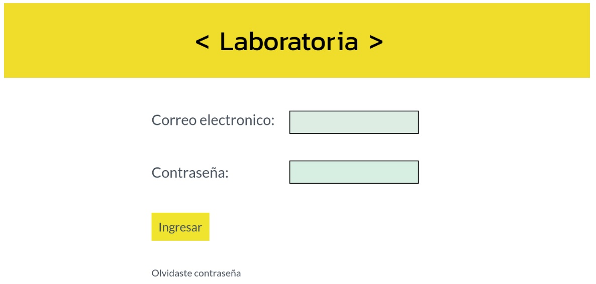
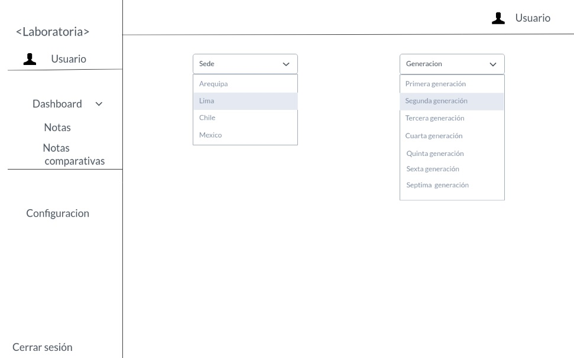
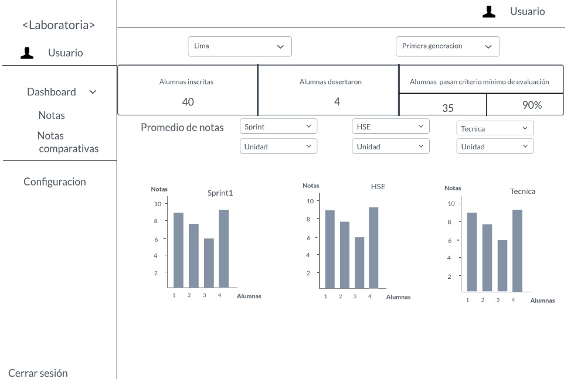
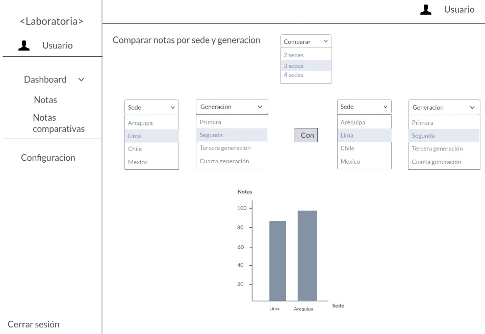

# Reto N° 3

## Objetivo

   * Crear un sketch para la herramienta del dashboard de Laboratoria.

### Contenido

El dashboard de Laboratoria es una herramienta que permite a los usuarios acceder rápidamente a datos estadísticos en tiempo real como:

 * Número de alumnas inscritas.

 * Número de alumnas que desertaron.

 * Número y % de alumnas que pasan el criterio mínimo de evaluación.

 * Promedio de notas por sprint.

 * Promedio de notas HSE.

 * Promedio de notas técnicas.

Adicionalmente, permite filtrar la data por Sedes (Arequipa, Ciudad de México, Lima y Santiago de Chile).

### Primera ventana

 * Se validara el ingreso con un correo electronico y la clave. Solo pueden ingresar profesores, training managers, directores y gerentes de Laboratoria.

 
 
 
 ### Segunda ventana
 
 * Para poder visualizar las notas de las alumnas de laboratoria, elegimos el dashboard "Notas" y  nos saldrá la siguiente
 imagen, filtramos la información  que deseamos por la Sede y la Generación que deseamos ver. 
 
 
 
 
 
 ### Tercera ventana
 
 * Para el ejemplo se eligió la Sede de  Lima y  la Primera generación.
 * Sale las alumnas inscritas, alumnas que desertaron y alumnas que pasaron el criterio minimo de evaluacion.
 * Para poder visualizar los promedios de Sprint, HSE y Técnicoo, se da la opción de  elegir la Unidad y el N° de Sprint para ver todo a    detalle, y se muestre los cuadros estadisticos de cada uno.
 
 
 
 
 
 ### Cuarta ventana
 
 * Se da la opción de elegir el segundo dashboard "Comparativo Notas", el cual sirve para comparar entre 2 a 4  sedes a las vez, de acuerdo a la generación que se eliga.
 
 * Se mostrara un cuadro  estadístico de la opción elegida. 
 
 
 
